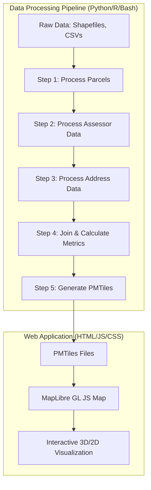

# Project Architecture: Value Per Acre Map

This project consists of a two-stage pipeline: a **Data Processing Pipeline** that transforms raw municipal/county datasets into optimized vector tiles, and a **Web Visualization Application** that renders these tiles in an interactive 3D/2D map.

## 1. High-Level Overview

The system follows a "Extract, Transform, Load" (ETL) pattern for spatial data, followed by a static web deployment.

## 2. Data Processing Pipeline

The pipeline is designed to handle large-scale property datasets by using chunked processing and spatial indexing.

### Components:
- **`scripts/01_process_parcels.py`**: Uses `GeoPandas` to load parcel geometries, fix invalid geometries, and optionally perform a spatial join to clip data to a specific city boundary.
- **`scripts/02_process_assessor_data.py`**: Uses `Pandas` to clean and aggregate property assessment values (e.g., summing condo units into a single building record).
- **`scripts/03_process_address_data.py`**: Cleans and standardizes address strings and links them to parcel identifiers.
- **`scripts/04_join_parcel_data.py`**: The core engine. It performs a spatial-attribute join, calculates derived metrics (Market Value, Value Per Acre, Tax Per Acre), and handles complex geometry aggregation (merging overlapping or contiguous parcels).
- **`scripts/05_generate_tiles.sh`**: Utilizes `Tippecanoe` to convert GeoJSON into `PMTiles` (Protocol Buffers for Tiles), optimizing for web delivery by managing zoom levels and feature density.
- **(Optional) R Scripts**: Used for advanced statistical modeling, such as simulating vacancy tax impacts using `PTAXSIM` data.

## 3. Web Application Architecture

The frontend is a lightweight, static web application built for high performance.

### Components:
- **`web/index.html`**: The application shell and UI controls (toggles for 3D, metric, and quality).
- **`web/js/map-core.js`**: The rendering engine. It uses `MapLibre GL JS` to manage the map state, handle 3D extrusions based on property value, and manage popup interactions.
- **`web/js/app.js`**: The application controller. It manages UI state, switches between different tile sets (e.g., City vs. County), and updates the legend.
- **`web/js/scales.js`**: Contains the mathematical logic for color scales (Choropleth) and legend generation.
- **`web/js/search.js`**: Provides functionality to search for specific addresses or parcels.

## 4. Chicago-Specific Components

While the architecture is generic, the current implementation contains several hardcoded dependencies on Chicago/Cook County data structures and logic:

### Data Dependencies:
- **Data Sources**: Specifically targets Cook County Assessor (CSV) and Chicago Boundary (GeoJSON) datasets.
- **Spatial Filtering**: The pipeline is hardcoded to look for a Chicago boundary to clip parcels.
- **Identifier Format**: Logic for standardizing 10-digit and 14-digit PINs (Property Index Numbers) unique to Cook County.

### Domain Logic:
- **Assessment Multipliers**: The `get_market_value_multiplier` function uses Cook County's specific assessment class ratios (e.g., Class 1 = 10% assessed).
- **Tax Data**: Integration with `PTAXSIM` (a Cook County-specific tax simulation tool).
- **UI Content**: Links to the Cook County Assessor website and references to Chicago-specific transit (CTA) overlays.

## 5. General/Reusable Components

The following elements are agnostic to the geographic region and can be reused for any city:
- **The ETL Pipeline Structure**: The sequence of processing, joining, and tiling.
- **The Tiling Strategy**: Using `PMTiles` for efficient, serverless vector tile delivery.
- **The Visualization Engine**: The 3D extrusion logic, metric switching (Value vs. Tax), and color scale application.
- **The Metric Calculations**: The fundamental math of `Value / Acre` and `Tax / Acre`.
